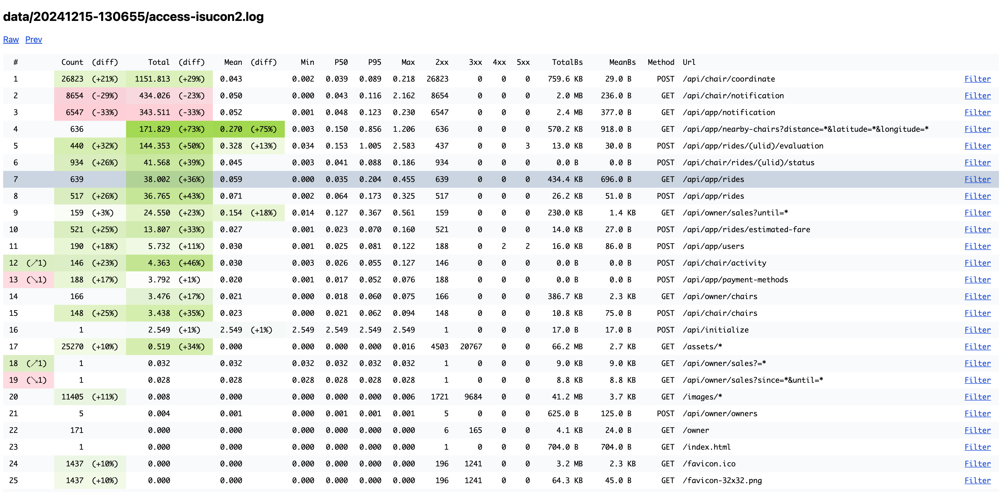
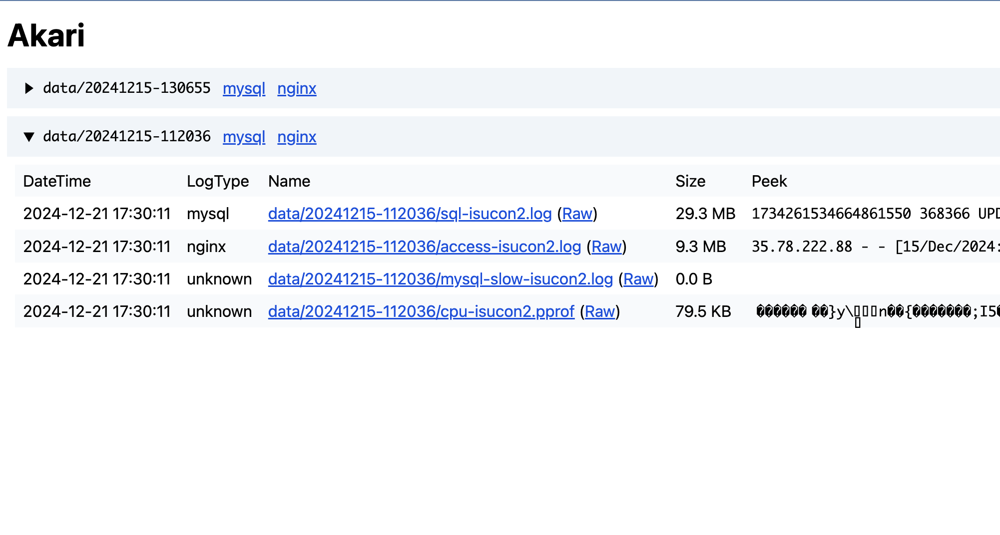
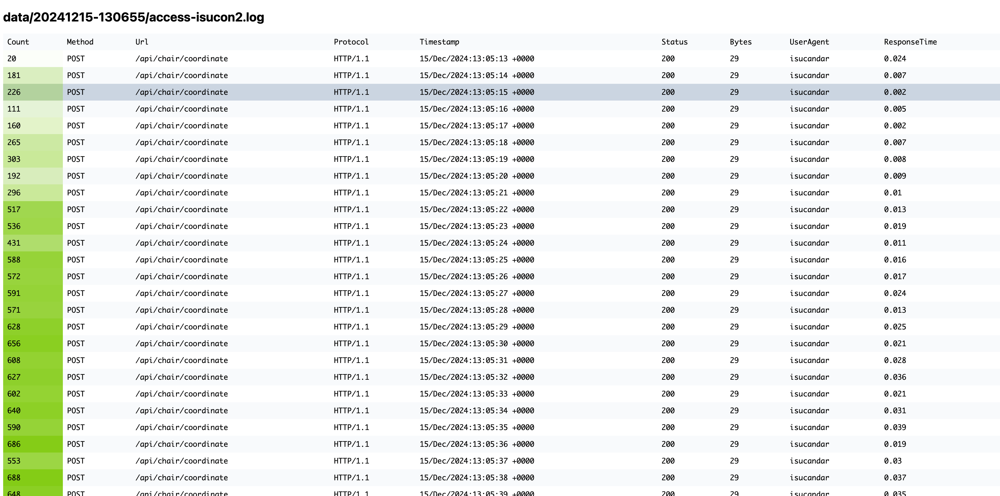

# Akari

Akari is a customizable log analyzer/viewer.

[](https://pkg.go.dev/github.com/myuon/akari)



## Install

```sh
go install github.com/myuon/akari@latest
```

## How to use

Run `akari init` to generate a new configuration file. (Default is configured for nginx logs)

```sh
akari init
```

Run `akari run` with the configuration file and the log file you want to analyze.

```sh
$ akari run -c config.yaml /var/log/nginx/access.log
 #  Count    Total   Mean    Min    P50    P95    Max    2xx    3xx  4xx  5xx    TotalBs     MeanBs  Method  Url
 1  22096  892.109  0.040  0.001  0.036  0.093  0.215  22096      0    0    0   625.8 KB    29.0 B     POST  /api/chair/coordinate
 2  12326  569.284  0.046  0.000  0.038  0.124  2.605  12326      0    0    0     2.9 MB   247.0 B      GET  /api/chair/notification
 3   9872  512.749  0.052  0.001  0.044  0.139  0.238   9872      0    0    0     3.7 MB   389.0 B      GET  /api/app/notification
 4    642   99.114  0.154  0.003  0.057  0.657  0.815    642      0    0    0   317.2 KB   505.0 B      GET  /api/app/nearby-chairs?distance=*&latitude=*&longitude=*
 5    331   95.665  0.289  0.033  0.119  0.977  2.717    328      0    0    3     9.8 KB    30.0 B     POST  /api/app/rides/(ulid)/evaluation
...
```

For nginx logs, you should add $request_time to the log_format directive in the nginx configuration file.

```nginx
log_format with_time '$remote_addr - $remote_user [$time_local] '
                     '"$request" $status $body_bytes_sent '
                     '"$http_referer" "$http_user_agent" $request_time';
```

Or you can serve the web interface with `akari serve`.

```sh
$ akari serve -c config.yaml ./logs
2025/01/03 13:29:07 INFO Starting server url=http://localhost:8089

# ./logs should be a directory containing log files like:
#   ./logs/1/access.log
#   ./logs/2/access.log
#   ./logs/3/access.log
#   ...
```

When you want to use web interface, you should put each log file in a directory and Akari assumes that the directory name is monotonic increasing (timestamp is recommended). Akari uses the previous file to show the difference, so sorts the directories in descending order.

## Configuration

You can customize the configuration file generated by `akari init`. The configuration file is written in TOML format.

The default configuration file is as follows:

```toml
[[analyzers]]
name = "nginx" # name of the analyzer (required)
groupingKeys = ["Method", "Url", "Protocol"] # which query columns to group by
sortKeys = ["Total", "Url"] # which query columns to sort by (default is descending order)
limit = 100 # how many rows to show
diffs = ["Count", "Total", "Mean"] # which query columns to show the difference
showRank = true # whether to show the rank

[analyzers.parser]
# See the [Parser configurations] section
regexp = '''^(\S+) - (\S+) \[(?P<Timestamp>[^\]]+)\] "(?P<Method>\S+) (?P<Url>\S+) (?P<Protocol>[^"]+)" (?P<Status>\d+) (?P<Bytes>\d+) "([^"]+)" "(?P<UserAgent>[^"]+)" (?P<ResponseTime>\S+)$'''
columns = [
  { name = "Method" },
  { name = "Url", converters = [
    { type = "queryParams", options = { replacer = "*" } },
    { type = "regexp", options = { replacer = "(ulid)", pattern = '''[0-9a-zA-Z]{26}''' } },
    { type = "regexp", options = { replacer = "(uuid)", pattern = '''[0-9a-f]{8}-[0-9a-f]{4}-[0-9a-f]{4}-[0-9a-f]{4}-[0-9a-f]{12}''' } },
    { type = "regexp", options = { replacer = "/assets/*", pattern = '''/assets/.*''' } },
    { type = "regexp", options = { replacer = "/images/*", pattern = '''/images/.*''' } },
  ] },
  { name = "Protocol" },
  { name = "Timestamp" },
  { name = "Status", converters = [
    { type = "parseInt" },
  ] },
  { name = "Bytes", converters = [
    { type = "parseInt" },
  ] },
  { name = "UserAgent" },
  { name = "ResponseTime", converters = [
    { type = "parseFloat64" },
  ] },
]


[[analyzers.query]]
# See the [Query configurations] section
from = "ResponseTime"
columns = [
  { name = "Count", function = "count" },
  { name = "Total", function = "sum" },
  { name = "Mean", function = "mean" },
  # { name = "Stddev", function = "stddev" },
  { name = "Min", function = "min" },
  { name = "P50", function = "p50" },
  # { name = "P90", function = "p90" },
  { name = "P95", function = "p95" },
  # { name = "P99", function = "p99" },
  { name = "Max", function = "max" },
]

[[analyzers.query]]
from = "Status"
function = "count"
columns = [
  { name = "2xx", filter = { type = "between", options = { start = 200, end = 300 } } },
  { name = "3xx", filter = { type = "between", options = { start = 300, end = 400 } } },
  { name = "4xx", filter = { type = "between", options = { start = 400, end = 500 } } },
  { name = "5xx", filter = { type = "between", options = { start = 500, end = 600 } } },
]

[[analyzers.query]]
from = "Bytes"
formatOption = { alignment = "right", humanizeBytes = true }
columns = [
  { name = "TotalBs", function = "sum" },
  { name = "MeanBs", function = "mean" },
  # { name = "MinBs", function = "min" },
  # { name = "MaxBs", function = "max" },
]

# [[analyzers.query]]
# from = "Protocol"

[[analyzers.query]]
from = "Method"
formatOption = { alignment = "right" }

[[analyzers.query]]
from = "Url"
```

### Parser configurations

- `regexp`: You can use named capturing groups in the regular expression.
- `columns`: You can specify the column name and the converter to apply to the column.
  - `name` (required): The name of the column.
  - `specifier.index`: If you don't use named capturing groups in the regular expression, you should specify the index of the capturing group here.
  - `converters`: You can specify the converter to apply to the column. Order matters.
    - type: The type of the converter. The supported types are:
      - `parseInt`: Parse the string as an integer.
      - `parseInt64`: Parse the string as an int64.
      - `parseFloat64`: Parse the string as a float64.
      - `regexp`: Replace the matched string with the specified string.
        - options:
          - `replacer`: The string to replace the matched string.
          - `pattern`: The regular expression pattern to match.
      - `queryParams`: Replace the query parameters with the specified string. (e.g. `?id=1&name=foo` -> `?id=*&name=*`)
        - options:
          - `replacer`: The string to replace the query parameters.
      - `unixNano`: Parse the int64 as a UnixNano.
      - `div`: Divide the number by the specified number.
        - options:
          - `divisor`: The number to divide.
    - options: The options for the converter.

### Query configurations

- `from` (required): The parser column name to query.
- `name`: The query name to show in the result. If not specified, the `from` value is used.
- `function` (required): The function to apply to the column. The supported functions are:
  - `count`: Count the number of rows.
  - `sum`: Sum the values.
  - `mean`: Calculate the mean.
  - `stddev`: Calculate the standard deviation.
  - `min`: Calculate the minimum value.
  - `p50`: Calculate the 50th percentile.
  - `p90`: Calculate the 90th percentile.
  - `p95`: Calculate the 95th percentile.
  - `p99`: Calculate the 99th percentile.
  - `max`: Calculate the maximum value.
- `formatOption`: The options for the format. The supported options are:
  - `alignment`: The alignment of the column. The supported values are:
    - `left`: Left alignment.
    - `right`: Right alignment.
  - `humanizeBytes`: Whether to humanize the bytes. (e.g. 1024 -> 1KB)
- `filter`: The filter to apply to the column. The supported filters are:
  - `between`: Filter the values between the start and end values.
    - options:
      - `start`: The start value.
      - `end`: The end value.
- `columns`: You can add multiple columns to the query at once.

## Images



